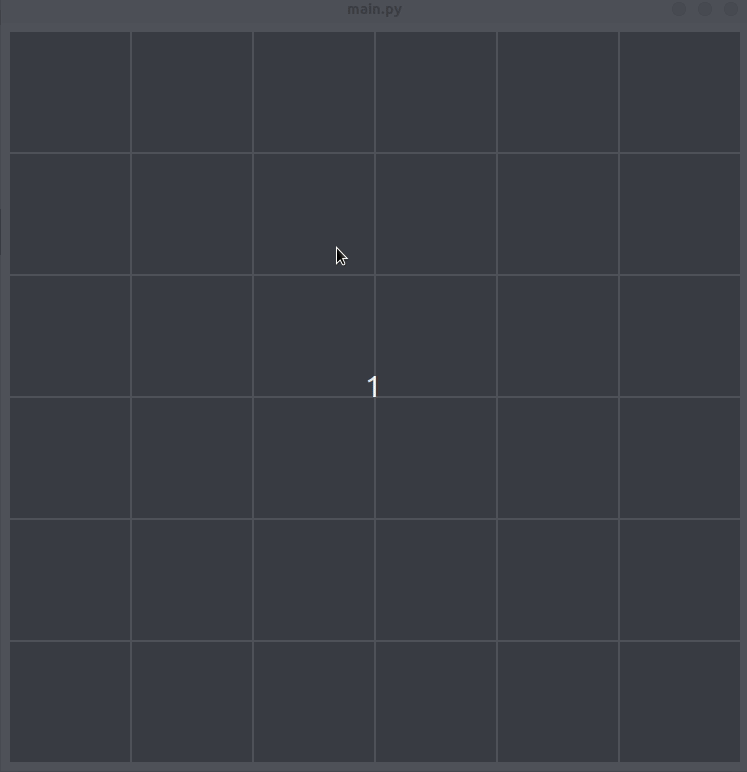

## Rotating around a point

Using transformation matrix.

## How:

0. Install Python3 which comes with ``pip``

1. Upgrade ``pip``

```
>> pip3 install --upgrade pip
```
2. Go to the ***root*** folder and run:

```
>> pip3 install -r requirements.txt
>> python3 main.py
```

## How to use:

- Click on a square to turn activate it. Click on it again to set it as a center point (``colored red``). Click for a third time to remove.

- **``Right click``** any where to rotate.

- Press **``r``** to change rotation direction

- Press **``q``** to quit.


